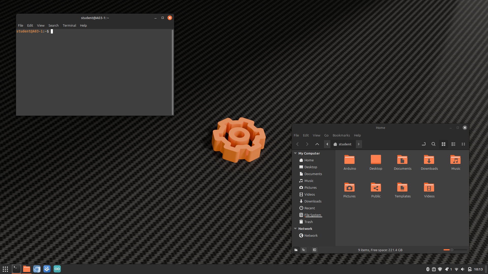

# A03 Flavored Linux Mint

Post installation script for our laptops



### What does this script do?

* Installs STEM [packages](./.packages) & apps
* Configures device permissions for Arduino & micro:bit
* Configures theme, background and splash screen

### Target

* For Linux Mint 22.0 Wilma

### How to run it

1. Download this repository as a `.zip` and extract it.

2. Open a terminal in the extracted directory and run:

```sh

wget https://github.com/atelier03-ca/post-install/archive/refs/heads/master.zip -O post-install.zip
unzip post-install.zip
cd post-install-master
chmod +x install.sh
sudo ./install.sh
```